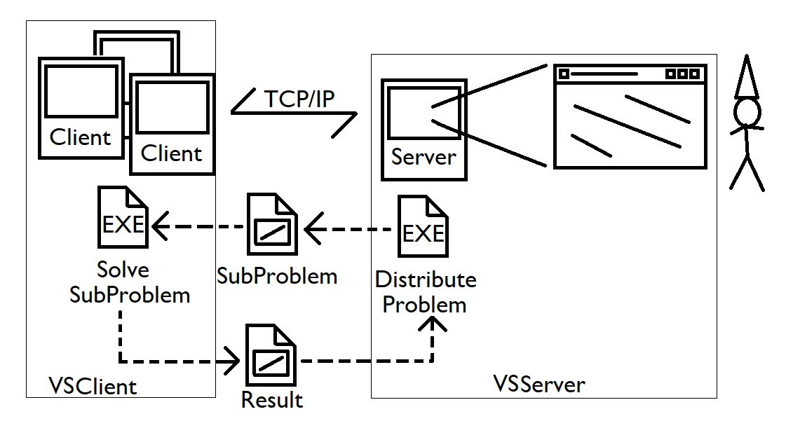
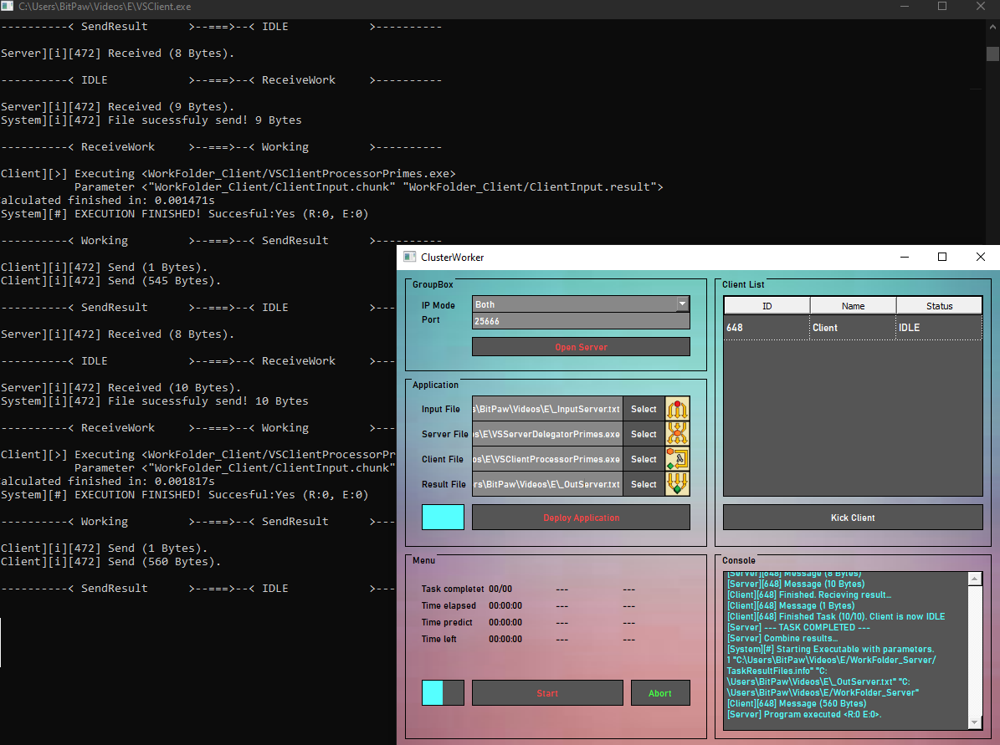

# [VS-Projekt] ClusterWorker (WS21)

## Teammitglieder
| Name | Martikelnummer | Studiengang | Aufgabe |
|:-----| :---------------:|:-----------:|:--:|
| Lukas Momberg | 11141259 | AI | Client & Server communication backbone |
| Dennis Goßler | 11140150 | AI | Client-Side problem solver |
| Jona Siebel | 11141394 | AI | Server UI & Server-Side problem delegation |

## Bilder

## CurrentUI (Test/Preview Version)

### User - Protocol
#### Both
- Install Software and Start Application
- Wait for a connection
#### Server
- Select deicated Client & Server side solutions
- Send client siede executable to all Clients.
- Initiate Server side and start creating problems to solve.
- The Sever will delegate everything, wait until finished. 

### Internal startup
| Name | Paramater 1 | Paramater 2 | Parameter 3 | Parameter 4 | Purpose |
|:--| :-:|:-:|:-:|:-:|:---|
| ServerSide.exe | Mode | InputFilePath | OutputFilePath | WorkingDirectory  (chunk & result files) | (Mode=1) Generate chunk files (Mode=2) Try merge result files |
| ClientSide.exe | InputFilePath (???.chunk)| OutputFilePath (???.result) | | | Solve chunkfile |
